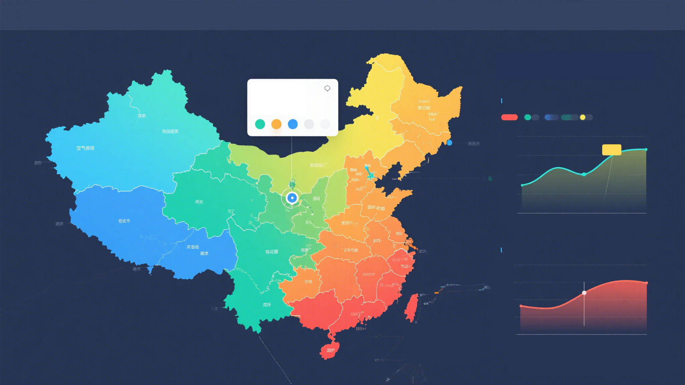

<h1 style="text_align:center;">VisProject 中期文档</h1>
成员：

​	刘烨

​	汪昕 

​	李文耀

## 1. 项目背景

​	在全球工业化进程加速与气候变化加剧的双重背景下，空气质量演变机制研究已成为环境科学、城市规划及公共健康领域的核心议题。近年来，我国深入贯彻落实生态文明建设战略部署，高度重视环境治理的科学决策与技术创新，“十四五” 规划明确提出构建智慧化生态环境监测网络，强化多要素耦合机制研究。

​    然而，传统的环境数据分析多依赖于表格、静态图表等形式，难以直观呈现多变量间的复杂关系与时空动态演变规律，限制了研究成果的传播效率与政策转化能力。现有研究多聚焦单一要素对空气质量的影响，或局限于较大尺度分析，缺乏对地级市这一基础行政单元的多变量耦合作用的系统性探究。地级市作为承载工业化与城市化的关键节点，其空气质量受工业排放、气候条件及时间周期的协同影响机理尚未得到充分揭示。

​    本项目基于多源异构数据整合，构建包含空气质量监测数据、气象参数、工业产值及时间序列的地级市尺度数据集，通过 Vue+D3 技术实现交互式可视化分析平台。研究以动态热力地图呈现空气质量空间分异特征，结合平行坐标图、时间序列分析及玫瑰图等模型，系统解析工业发展与气候要素对空气质量的时空交互影响。项目成果不仅为环境政策制定者提供直观的决策依据，助力精准化污染治理；同时也为学术界探索人类活动与自然环境的动态关联提供新的可视化研究范式，对推动城市可持续发展与生态环境协同治理具有重要的理论价值与现实意义。

## 2. 设计方案

### 2.1. 数据收集与预处理

1. 核心数据的获取，包括各地级市近年空气质量数据，风力降水等天气数据，工业产值数据，空气质量数据。
2. 剔除明显错误的数据，用线性插值填充缺失数据。
3. 按照地级市，季节，年等时空维度聚合，形成 JSON 文件

### 2.2. 核心图表设计

| **图表类型**     | **功能**                                                     | **技术实现**                    | **呈现目标**                         |
| ---------------- | ------------------------------------------------------------ | ------------------------------- | ------------------------------------ |
| **设色地图**     | 展示地级市空气质量空间分布（以空气质量为衡量标准）           | D3 地理投影 + 颜色比例尺        | 直观呈现污染热点区域与地理聚集性     |
| **交互式时间轴** | 切换时间范围，联动地图与各个数据，用多种基础图标可视化相关数据 | Vue 响应式数据 + D3 zoom 行为   | 分析时间变化趋势                     |
| **平行坐标图**   | 多变量相关性分析，风力、降水、工业产值等变量与空气质量的相关性 | D3 轴线布局 + 数据刷选          | 揭示多因素对空气质量的综合影响       |
| **气泡散点图**   | 直观展现各城市如工业产值等数值的规模                         | D3 scaleSize + 颜色编码城市类别 | 量化数据                             |
| **玫瑰图**       | 各城市不同月份降水与污染物分布对比                           | D3 polarArea 生成极坐标图表     | 突出季节性降水等数据与空气质量的关联 |

### 2.3. 页面设计

#### 2.3.1. 页面设计

- 顶部显示研究背景
- 主视图呈现全国空气质量地图

* 点击城市，右侧弹出该城市的时间序列图表

#### 2.3.2. 交互逻辑

- 基础交互
  - 地图点击：弹出城市详情卡片，显示按城市聚合的各个指标、时间序列趋势。
  - 图表刷选：在时间轴或数据类别中框选数据范围。
- 高级交互
  - 变量切换：通过下拉菜单动态更换各个指标。
  - 模式切换：可以切换不同图表表示。

- 配色方案
  - 空气质量：采用蓝 - 绿 - 黄 - 橙 - 红渐变色，符合环保领域通用色阶。
  - 工业产值：用冷色调（如蓝色）区分，避免与污染色混淆。
- 标注与注释
  - 图表标题：明确变量关系
  - 坐标轴：标注单位
  - 图例：说明颜色 / 形状对应的变量，添加数据来源注释。
- 统计指标可视化
  - 在趋势图中叠加 95% 置信区间
  - 在相关性图表显示 Pearson 相关系数（r 值）及 p 值（<0.05 用星号标注）。.

#### 2.3.3. 开发流程

- 用 Node.js 或 Python Flask 搭建本地 API，读取预处理后的 JSON 数据
- 封装 D3 图表为 Vue 组件

### 2.4. 展示与总结

将形成一下内容供展示：

- 系统文档：包括设计需求、设计介绍、案例展示。
- 工程代码：可视化设计，能够展示出数据模式（pattern）。
- 录制视频展示。

## 3. 目前实现进展

1. 完成了关于空气质量的数据搜集，对 AQI.csv 做了一定的过滤，仅保留了可与省份/直辖市匹配的地级市。city.csv 给出了省份/直辖市与地级市的匹配。

2. 完成了基础的基于 vue + D3 的框架搭建，使用仓库储存。

## 4. 待完成的工作

1. 搜索并处理各地级市降水、风力和工业产值的每月数据
2. 实现数据可视化与交互
3. 完成说明与展示

